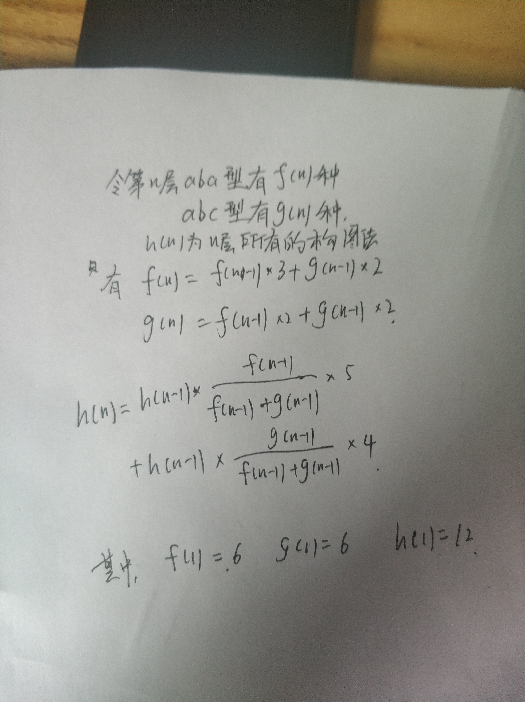

```CPP
class Solution {
public:
    int numOfWays(int n) {
        if (n == 1) return 12;
        int MOD = pow(10,9)+7;
        long long aba = 6, abc = 6;
        for (int i = 2; i <= n; ++i) {
            long aba_new = aba*3+abc*2,
                abc_new = aba*2+abc*2;
            aba = aba_new;
            abc = abc_new;
            aba %= MOD;
            abc %= MOD;
        }
        return (aba+abc)%MOD;
    }
};
// 下面对于小n可以，大n错误
class Solution {
public:
    int numOfWays(int n) {
        if (n == 1) return 12;
        int MOD = pow(10,9)+7;
        long long h = 12, aba = 6, abc = 6;
        for (int i = 2; i <= n; ++i) {
            long long h_new = h*aba/(aba+abc)*5+h*abc/(aba+abc)*4,
                aba_new = aba*3+abc*2,
                abc_new = aba*2+abc*2;
            h = h_new;
            aba = aba_new;
            abc = abc_new;
            h %= MOD;
            aba %= MOD;
            abc %= MOD;
        }
        return h;
    }
};
```

思路：再添一行：对于aba型，添加的行有5种情况(其中aba型3种，abc型2种)；对于abc型，添加的行有4种情况(其中aba型2种，abc型2种)。

n=1时，共有abc型6种，abc型6种。6+6=12。

n=2时，上一行为aba型有6种，6\*5；上一行为abc型也有6种，6\*4。共6\*5+6\*4=54。

n=3时，54\*(5/9)\*5+54\*(4/9)\*4=246。



现在要处理的是当n比较大时h(n)也会非常大的问题。