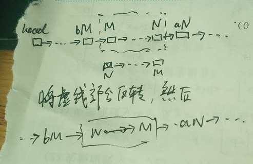

```CPP
/**
 * Definition for singly-linked list.
 * struct ListNode {
 *     int val;
 *     ListNode *next;
 *     ListNode() : val(0), next(nullptr) {}
 *     ListNode(int x) : val(x), next(nullptr) {}
 *     ListNode(int x, ListNode *next) : val(x), next(next) {}
 * };
 */
class Solution {
public:
    ListNode* reverseBetween(ListNode* head, int m, int n) {
        if (m==n) return head;
        ListNode *beforeM=NULL, *M=NULL, *N=NULL, *afterN=NULL;
        ListNode* node = head, *pre = NULL;
        ListNode* next = NULL;
        for (int i = 1; node!=NULL; ++i, node=next) {
            next = node->next;
            if (i==m-1) beforeM = node;
            else if (i==n+1) afterN = node;
            else if (i==m) M = node;
            else if (i==n) N = node;
            if (i>m&&i<=n) node->next = pre;
            pre = node;
        }
        if (beforeM) beforeM->next = N;
        else head = N;
        M->next = afterN;
        return head;
    }
};
```

题意：给出一条链表，要求翻转第m到第n个结点的部分(从1计数)，要求一次完成。

思路：

