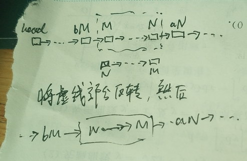

```CPP
/**
 * Definition for singly-linked list.
 * struct ListNode {
 *     int val;
 *     ListNode *next;
 *     ListNode() : val(0), next(nullptr) {}
 *     ListNode(int x) : val(x), next(nullptr) {}
 *     ListNode(int x, ListNode *next) : val(x), next(next) {}
 * };
 */
class Solution {
public:
    ListNode* reverseBetween(ListNode* head, int m, int n) {
        if (m==n) return head;
        ListNode *beforeM=NULL, *M=NULL, *N=NULL, *afterN=NULL;
        ListNode* node = head, *pre = NULL;
        ListNode* next = NULL;
        for (int i = 1; node!=NULL; ++i, node=next) {
            next = node->next;
            if (i==m-1) beforeM = node;
            else if (i==n+1) afterN = node;
            else if (i==m) M = node;
            else if (i==n) N = node;
            if (i>m&&i<=n) node->next = pre;
            pre = node;
        }
        if (beforeM) beforeM->next = N;
        else head = N;
        M->next = afterN;
        return head;
    }
};
```

题意：给出一条链表，要求翻转第m到第n个结点的部分(从1计数)，要求一次完成。

思路：



```js
/**
 * Definition for singly-linked list.
 * function ListNode(val, next) {
 *     this.val = (val===undefined ? 0 : val)
 *     this.next = (next===undefined ? null : next)
 * }
 */
/**
 * @param {ListNode} head
 * @param {number} left
 * @param {number} right
 * @return {ListNode}
 */
var reverseBetween = function(head, left, right) {
    let currentNode = head, preNode = null
    let beforeLeft = null, afterRight = null
    let leftNode = null, rightNode = null
    for (let i = 1;currentNode&&i<=right+1; i++) {
        if (i==left-1) beforeLeft = currentNode
        if (i==left) leftNode = currentNode
        if (i==right) rightNode = currentNode
        if (i==right+1) afterRight = currentNode
        let next = currentNode.next
        if (i>=left+1&&i<=right) currentNode.next = preNode
        preNode = currentNode
        currentNode = next
    }
    if (beforeLeft) beforeLeft.next = rightNode
    leftNode.next = afterRight
    if (beforeLeft==null) head = rightNode
    return head
};
```

